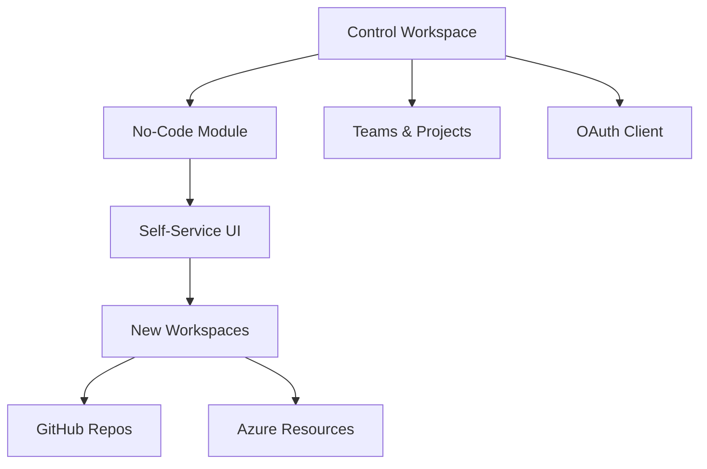

# HCP Terraform Control Workspace Setup Guide

This document provides step-by-step instructions for setting up a Terraform Control Workspace with no-code modules for managing HCP Terraform workspaces.

## Overview

The HCP Terraform Control Workspace provides:

1. **Automated Workspace Management**: Create and configure HCP Terraform workspaces programmatically
2. **No-Code Self-Service**: Allow teams to create workspaces through a web UI without Terraform knowledge
3. **Standardized Configurations**: Ensure consistent workspace settings, security, and integrations
4. **GitHub Integration**: Automatic VCS connection for infrastructure-as-code workflows

## Architecture



## Prerequisites

### 1. HCP Terraform Organization
- Organization: `dlp-org`
- Organization ID: `org-mhf7eMEcUbJKwSys`
- Admin access to the organization

### 2. Authentication Tokens
- **HCP Terraform API Token**: Generate from user settings
- **GitHub OAuth Token**: Personal access token with repo permissions

### 3. Azure Service Principal
```bash
# Create service principal
az ad sp create-for-rbac --name "hcp-terraform-sp" --role="Contributor"

# Note the output values:
# - appId (client_id)
# - password (client_secret)
# - tenant (tenant_id)
```

## Setup Instructions

### Step 1: Clone and Prepare Repository

```bash
git clone https://github.com/donnielpage/hcp_stack.git
cd hcp_stack/terraform/control-workspace
```

### Step 2: Configure Authentication

```bash
# Set HCP Terraform token
export TFE_TOKEN="your-hcp-terraform-api-token"

# Alternative: Use terraform login
terraform login
```

### Step 3: Configure Variables

```bash
# Copy the example variables
cp terraform.tfvars.example terraform.tfvars

# Edit with your values
vim terraform.tfvars
```

Required variables in `terraform.tfvars`:
```hcl
# Organization
organization_name = "dlp-org"
organization_id   = "org-mhf7eMEcUbJKwSys"

# GitHub Integration
github_oauth_token = "ghp_xxxxxxxxxxxxxxxxxxxx"
module_repository  = "donnielpage/hcp_stack"

# Azure Credentials
azure_subscription_id = "12345678-1234-1234-1234-123456789012"
azure_tenant_id      = "87654321-4321-4321-4321-210987654321"
azure_client_id      = "abcdef12-3456-7890-abcd-ef1234567890"
azure_client_secret  = "your-client-secret"
```

### Step 4: Initialize and Deploy

```bash
# Initialize Terraform
terraform init

# Review the plan
terraform plan

# Apply the configuration
terraform apply
```

### Step 5: Verify Deployment

After successful deployment, verify:

1. **Control Workspace**: https://app.terraform.io/app/dlp-org/workspaces/control-workspace
2. **No-Code Module**: https://app.terraform.io/app/dlp-org/registry/modules/private/dlp-org/workspace-manager/tfe
3. **Example Workspace**: Check that the example workspace was created

## Using the No-Code Module

### Self-Service Workspace Creation

1. Navigate to the no-code module URL
2. Click "Provision workspace"
3. Fill in the form:
   - **Workspace Name**: `my-new-workspace`
   - **Environment**: Select from dropdown (dev/staging/prod)
   - **GitHub Repository**: `myorg/my-repo`
   - **Terraform Version**: Select from available versions
   - **Working Directory**: Path to Terraform files
   - **Cloud Provider**: Select primary provider

### Available Options

| Field | Options | Description |
|-------|---------|-------------|
| Environment | dev, staging, prod | Environment type |
| Terraform Version | 1.11.0, 1.10.2, 1.9.8, 1.8.5 | Terraform version |
| Execution Mode | remote, local, agent | Where runs execute |
| Working Directory | /, /terraform, /infrastructure | Terraform files location |
| Cloud Provider | aws, azure, gcp, multi-cloud | Primary cloud platform |
| GitHub Branch | main, master, develop | Git branch to track |

## Module Features

### Workspace Manager Module

Located at `terraform/modules/hcp-workspace-manager/`, the module provides:

- **VCS Integration**: Automatic GitHub connection
- **Variable Management**: Environment and Terraform variables
- **Team Access**: Permission-based access control
- **Notifications**: Slack, email, webhook integrations
- **Tagging**: Automatic workspace categorization

### Example Usage

```hcl
module "production_workspace" {
  source = "../modules/hcp-workspace-manager"
  
  workspace_name = "myapp-prod"
  organization   = "dlp-org"
  
  github_repo   = "myorg/myapp-infrastructure"
  github_branch = "main"
  
  environment_variables = {
    ARM_SUBSCRIPTION_ID = {
      value     = var.azure_subscription_id
      sensitive = true
    }
  }
  
  tags = ["production", "myapp", "managed"]
}
```

## Organization Structure

The control workspace creates:

### Projects
- **infrastructure**: Core networking and platform
- **applications**: Application workspaces
- **security**: Security and compliance
- **shared-services**: Common utilities

### Teams
- **platform-engineers**: Full organization access
- **developers**: Limited workspace access
- **security-team**: Policy management access

## Common Workflows

### Bulk Workspace Creation

```hcl
locals {
  applications = {
    "web-app" = "myorg/web-app-infrastructure"
    "api-service" = "myorg/api-infrastructure"
    "database" = "myorg/database-infrastructure"
  }
}

module "app_workspaces" {
  source = "../modules/hcp-workspace-manager"
  
  for_each = local.applications
  
  workspace_name = "${each.key}-prod"
  organization   = "dlp-org"
  github_repo    = each.value
  
  tags = ["production", each.key, "managed"]
}
```

### Environment-Based Creation

```hcl
locals {
  environments = ["dev", "staging", "prod"]
}

module "multi_env_workspaces" {
  source = "../modules/hcp-workspace-manager"
  
  for_each = toset(local.environments)
  
  workspace_name = "myapp-${each.value}"
  organization   = "dlp-org"
  
  auto_apply = each.value == "dev" ? true : false
  
  working_directory = "/terraform/environments/${each.value}"
  tags = [each.value, "myapp", "managed"]
}
```

## Security Considerations

### Credential Management
- Store sensitive variables as HCP Terraform environment variables
- Use Azure Key Vault for production secrets
- Rotate service principal credentials regularly

### Access Control
- Implement least-privilege team permissions
- Use workspace-specific access controls
- Monitor workspace creation and access logs

### VCS Security
- Limit GitHub OAuth scope to necessary repositories
- Use branch protection rules
- Implement required status checks

## Troubleshooting

### Common Issues

1. **Authentication Errors**
   ```bash
   # Verify token
   curl -H "Authorization: Bearer $TFE_TOKEN" \
        https://app.terraform.io/api/v2/organizations/dlp-org
   ```

2. **OAuth Client Issues**
   ```bash
   # Re-apply OAuth client
   terraform apply -replace=tfe_oauth_client.github
   ```

3. **Module Registry Problems**
   - Verify repository access permissions
   - Check VCS connection status
   - Ensure module structure is correct

### Useful Commands

```bash
# Import existing workspace
terraform import module.example.tfe_workspace.managed_workspace ws-xxxxxxxxxxxxx

# List current workspaces
terraform state list | grep tfe_workspace

# Refresh OAuth connection
terraform refresh
```

## Monitoring and Maintenance

### Regular Tasks
- Review workspace usage and costs
- Update Terraform versions in the no-code module
- Monitor failed runs and assist teams
- Update team memberships and permissions

### Scaling Considerations
- Monitor HCP Terraform organization limits
- Plan for workspace lifecycle management
- Consider workspace archival policies
- Implement cost allocation tracking

## Next Steps

1. **Team Training**: Educate teams on self-service workspace creation
2. **Policy Implementation**: Add Sentinel policies for governance
3. **Cost Management**: Implement workspace tagging for cost allocation
4. **Monitoring**: Set up alerts for failed runs and policy violations
5. **Documentation**: Create team-specific workspace creation guides

## Resources

- [HCP Terraform Documentation](https://developer.hashicorp.com/terraform/cloud-docs)
- [TFE Provider Documentation](https://registry.terraform.io/providers/hashicorp/tfe/latest/docs)
- [No-Code Modules Guide](https://developer.hashicorp.com/terraform/cloud-docs/no-code-provisioning)
- [Workspace Module README](../terraform/modules/hcp-workspace-manager/README.md)